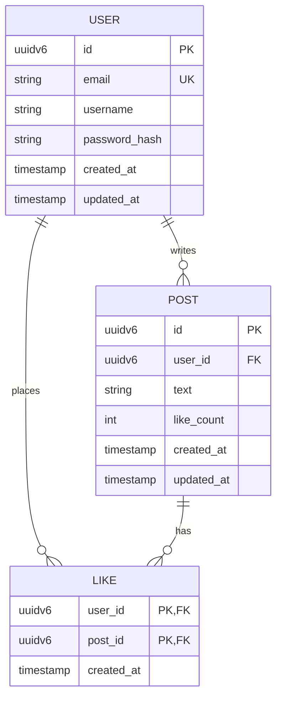

# social-network

## Database

```mermaid
erDiagram
	USER ||--o{ LIKE : "places"
	USER ||--o{ POST : "writes"
	POST ||--o{ LIKE : "has"

	USER {
		uuidv6 id PK
		string email UK
		string username
		string password_hash
		timestamp created_at
		timestamp updated_at
	}
	POST {
		uuidv6 id PK
		uuidv6 user_id FK
		string text
		int like_count
		timestamp created_at
		timestamp updated_at
	}
	LIKE {
		uuidv6 user_id PK, FK
		uuidv6 post_id PK, FK
		timestamp created_at
	}
```

